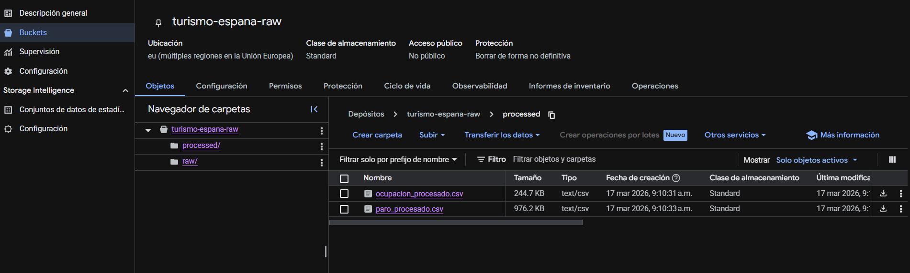
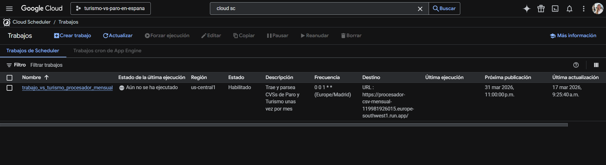
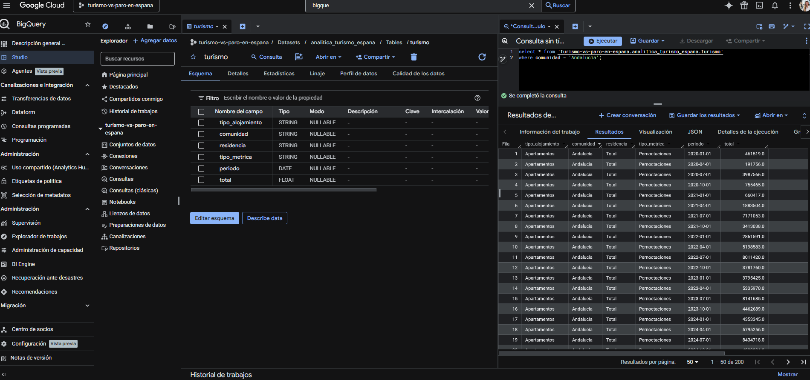

# 🚀 Data Pipeline Automatizado: Turismo vs. Empleo en España

Este proyecto implementa una solución de **Ingeniería de Datos end-to-end** en **Google Cloud Platform (GCP)**. El objetivo es automatizar la extracción, transformación y carga (ETL) de datos provenientes del **INE (Instituto Nacional de Estadística)** para analizar la relación entre el sector turístico y el mercado laboral.

---

## 📊 Arquitectura del Proyecto

El sistema está diseñado bajo una arquitectura **Serverless**, optimizando costes y garantizando escalabilidad:

1.  **Origen de Datos:** Web oficial del INE (Archivos CSV dinámicos).
2.  **Ingesta y Procesamiento:** [Google Cloud Functions](https://cloud.google.com/functions) (Python 3.10+).
3.  **Almacenamiento de Archivos:** [Google Cloud Storage](https://cloud.google.com/storage) (Arquitectura de capas Raw/Processed).
4.  **Orquestación:** [Cloud Scheduler](https://cloud.google.com/scheduler) (Ejecución mensual mediante tareas cron).
5.  **Data Warehouse:** [Google BigQuery](https://cloud.google.com/bigquery) (Tablas externas para análisis en tiempo real).
6.  **Visualización:** Power BI (Conexión nativa mediante BigQuery Connector).

---

## 🛠️ Proceso de Desarrollo

### 1. Exploración y Parseo Local
El proyecto inició con una fase de **EDA (Exploratory Data Analysis)** en local. Utilicé scripts en Python para limpiar los datos crudos, estandarizar formatos de fecha y normalizar las columnas de provincias y sectores para asegurar la integridad de los datos.

### 2. Infraestructura en la Nube (GCP)
Configuré un entorno seguro en Google Cloud utilizando un **Bucket de Storage** con una estructura jerárquica:
* `gs://tu-bucket/raw/`: Backup de los archivos originales sin modificar.
* `gs://tu-bucket/processed/`: Archivos limpios, parseados y listos para analítica.

### 3. Automatización del Pipeline (ETL)
Adapté la lógica de procesamiento para entornos en la nube:
* **Cloud Functions:** Desarrollé una función que descarga el CSV desde la URL del INE, aplica las transformaciones en memoria (evitando uso excesivo de disco) y sube los resultados a Storage.
* **Automatización:** Configuré un trabajo en **Cloud Scheduler** que ejecuta el pipeline el primer día de cada mes a las 00:00, eliminando la necesidad de intervención manual.

### 4. Data Warehousing
Para la capa de servicio, utilicé **BigQuery**. Creé tablas externas que apuntan directamente a la carpeta `processed/` del Bucket. Esto permite que cualquier nuevo archivo generado por la Cloud Function se integre automáticamente en las tablas de la base de datos sin necesidad de cargas adicionales.

---

## 💻 Stack Tecnológico

* **Lenguajes:** Python (Pandas, Requests).
* **Nube (GCP):** Cloud Functions, Cloud Storage, Cloud Scheduler, BigQuery.
* **Business Intelligence:** Power BI.
* **Seguridad:** IAM Roles, OIDC Authentication.

## 📩 Contacto
**Yanina Petrongari** - [LinkedIn](https://www.linkedin.com/in/yaninap/) - 
